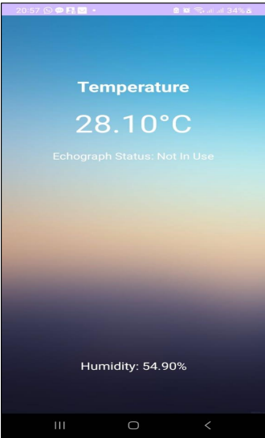
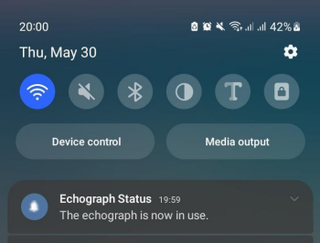
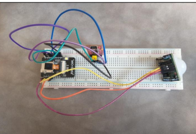
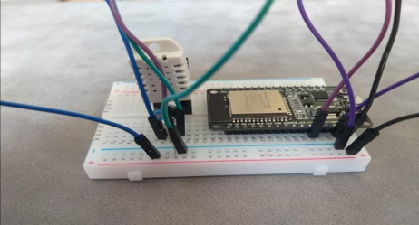

# 🏥 Système de Surveillance d'une Échographie

> Rapport de Stage Technique — Génie Informatique Embarquée  
> Centre Hospitalier Universitaire Mohammed VI — Oujda  
> Année universitaire : **2023 / 2024**

---

## 👥 Réalisé par

| Nom | Filière |
|-----|---------|
| Safae El ATTAR | Génie Informatique Embarquée |
| Jihane BOURAS | Génie Informatique Embarquée |
| Hafsa EL JAROUDI | Génie Informatique Embarquée |

**Encadrante de stage :** Madame Sanae Lamti  
**Jury :** Pr. Omar Moussaoui, M. Abdelaziz Benkhalifa  
**Soutenu le :** 04/06/2024  
**Organisme d'accueil :** CHU Mohammed VI Oujda

---

## 📌 Description du projet

Ce projet, réalisé au sein du service informatique du CHU Mohammed VI d'Oujda (avril–mai 2024), porte sur le développement d'un **système IoT de surveillance en temps réel des échographes hospitaliers**.

Le système intègre des capteurs et microcontrôleurs pour :
- Détecter les entrées dans la salle d'échographie (capteur PIR)
- Capturer des photos lors de chaque détection (ESP32-CAM + carte SD)
- Surveiller la température de l'échographe (DHT22 + ESP32)
- Alerter le personnel hospitalier via une application Android

---

## 🎯 Problématique

> *Comment assurer la disponibilité, le bon fonctionnement, la sécurité et l'efficacité opérationnelle des échographes tout en optimisant leur utilisation et en minimisant les pannes ?*

---

## 🏗️ Architecture du système

```
┌─────────────────┐     GPIO D4      ┌────────────────┐
│   Capteur DHT22 │ ───────────────► │     ESP32      │
│ (Temp + Humidité)│                 │ (Microcontrôleur)│
└─────────────────┘                  └───────┬────────┘
                                             │ Wi-Fi / HTTP POST
                                             ▼
┌─────────────────┐     GPIO 13      ┌────────────────┐
│  Capteur PIR    │ ───────────────► │   ESP32-CAM    │
│  HC-SR501       │                 │ (Caméra + SD)  │
└─────────────────┘                  └────────────────┘
                                             │
                                    ┌────────▼────────┐
                                    │  Serveur Flask  │
                                    │  (Python HTTP)  │
                                    └────────┬────────┘
                                             │ HTTP GET
                                    ┌────────▼────────┐
                                    │ Application     │
                                    │ Android         │
                                    └─────────────────┘
```

---

## 🔧 Matériels et logiciels utilisés

### Matériels

| Composant | Rôle |
|-----------|------|
| ESP32 | Microcontrôleur central, collecte et transmet les données |
| Capteur DHT22 | Mesure température et humidité de l'échographe |
| ESP32-CAM | Capture photos à la détection de mouvement |
| Capteur PIR HC-SR501 | Détection de présence dans la salle |
| Carte SD | Stockage des photos capturées |

### Logiciels

| Outil | Usage |
|-------|-------|
| Arduino IDE | Programmation ESP32 et ESP32-CAM (C++) |
| Android Studio | Développement application mobile Android |
| Flask (Python) | Serveur HTTP de collecte et exposition des données |
| SysML (Papyrus) | Modélisation du système |

---

## ✨ Fonctionnalités

- 🌡️ **Surveillance température en temps réel** : détection de l'état de l'échographe (En service si T° > 34°C)
- 📸 **Capture automatique** : photo prise à chaque détection de mouvement, sauvegardée sur carte SD
- 📱 **Application Android** : affichage température, humidité, statut et réception d'alertes push
- 🔔 **Notifications** : alerte instantanée quand l'échographe passe à l'état "In Use"
- 🔄 **Mise à jour périodique** : rafraîchissement des données toutes les 5 secondes

---

## 📁 Structure du projet

```
surveillance-echographie/
├── arduino/
│   ├── surveillance_temperature.ino   ← ESP32 + DHT22
│   └── capture_mouvement_esp32cam.ino ← ESP32-CAM + PIR
├── serveur/
│   └── server.py                      ← Serveur Flask (Python)
├── android/
│   └── (code source application Android)
├── rapport/
│   └── rapport_stage_pfe_2024.pdf
└── README.md
```

---

## 🚀 Installation et lancement

### 1. Prérequis

- Arduino IDE (avec support ESP32)
- Python 3.x
- Android Studio
- Bibliothèques Arduino : `DHT sensor library`, `ESP32 Camera`

### 2. Serveur Flask

```bash
# Installer les dépendances Python
pip install flask flask-cors

# Lancer le serveur
python serveur/server.py
```

Le serveur écoute sur `http://0.0.0.0:5000`

### 3. ESP32 (surveillance température)

Ouvrir `arduino/surveillance_temperature.ino` dans Arduino IDE et modifier :

```cpp
const char* ssid       = "VOTRE_SSID";
const char* password   = "VOTRE_MOT_DE_PASSE";
const char* serverName = "http://VOTRE_IP:5000/post-data";
```

Sélectionner la carte `ESP32 Dev Module` et téléverser.

### 4. ESP32-CAM (détection mouvement)

Ouvrir `arduino/capture_mouvement_esp32cam.ino` dans Arduino IDE.  
Sélectionner la carte `AI Thinker ESP32-CAM` et téléverser.

### 5. Application Android

Ouvrir le dossier `android/` dans Android Studio.  
Modifier l'adresse IP du serveur dans le fichier source principal :

```java
private static final String URL = "http://VOTRE_IP:5000/get-data";
```

Compiler et installer l'APK sur le téléphone Android.

---

## 📡 API du serveur Flask

| Route | Méthode | Description |
|-------|---------|-------------|
| `/` | GET | Vérification du serveur |
| `/post-data` | POST | Réception données DHT22 (temp + humidity) |
| `/get-data` | GET | Récupération données pour l'application Android |

**Exemple de réponse `/get-data` :**
```json
{
  "temperature": 28.10,
  "humidity": 54.90,
  "status": "Not In Use"
}
```

**Logique de statut :**
- Température **> 34°C** → `"In Use"` (échographe en fonctionnement)
- Température **≤ 34°C** → `"Not In Use"` (échographe au repos)

---

## 🔌 Schéma de câblage

### ESP32 + DHT22
```
DHT22 DATA  →  GPIO D4 (ESP32)
DHT22 VCC   →  3.3V
DHT22 GND   →  GND
```

### ESP32-CAM + Capteur PIR HC-SR501
```
PIR Signal  →  GPIO 13 (ESP32-CAM)
PIR VCC     →  5V
PIR GND     →  GND
```

---

## 📊 Résultats

L'application Android affiche en temps réel :
- La **température** de l'échographe
- Le **taux d'humidité**
- Le **statut** : *In Use* / *Not In Use*
- Une **notification push** dès que l'échographe est mis en service




### 🔌 Montage matériel



## 🔮 Perspectives d'amélioration

- Extension du système à d'autres équipements médicaux
- Ajout de capteurs supplémentaires (humidité, vibration)
- Intégration GPS/RFID pour localisation et suivi en temps réel
- Interface utilisateur plus intuitive
- Renforcement de la sécurité et confidentialité des données

---

## 📚 Références

- [Documentation ESP32](https://docs.espressif.com/projects/esp-idf/en/latest/esp32/index.html)
- [Documentation Arduino IDE](https://www.arduino.cc/reference/en/)
- [Random Nerd Tutorials](https://randomnerdtutorials.com/)
- [Documentation Flask](https://flask.palletsprojects.com/)
- [SysML — Papyrus](https://www.eclipse.org/papyrus/)

---

## 📄 Licence

Projet académique — Stage technique réalisé au CHU Mohammed VI Oujda.  
École Supérieure de Technologie — Université Mohammed Premier Oujda.  
Usage éducatif uniquement.
